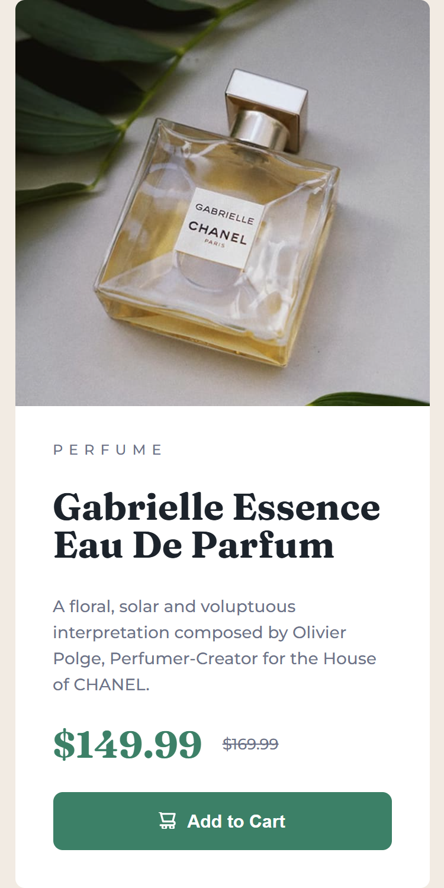

# Frontend Mentor - Product preview card component solution

This is a solution to the [Product preview card component challenge on Frontend Mentor](https://www.frontendmentor.io/challenges/product-preview-card-component-GO7UmttRfa). Frontend Mentor challenges help you improve your coding skills by building realistic projects. 

## Table of contents

- [Overview](#overview)
  - [The challenge](#the-challenge)
  - [Screenshot](#screenshot)
  - [Links](#links)
- [My process](#my-process)
  - [Built with](#built-with)
  - [What I learned](#what-i-learned)
  - [Continued development](#continued-development)
  - [Useful resources](#useful-resources)
  - [AI Collaboration](#ai-collaboration)
- [Author](#author)
- [Acknowledgments](#acknowledgments)

## Overview

### The challenge

Users should be able to:

- View the optimal layout depending on their device's screen size
- See hover and focus states for interactive elements

### Screenshot

### Links

- Solution URL: [Solution URL](https://github.com/Faith-Rose1/Product-preview-card)
- Live Site URL: [Live Site URL](https://faith-rose1.github.io/Product-preview-card/)

## My process

### Built with

- Semantic HTML5 markup
- CSS custom properties
- Flexbox
- Mobile-first workflow

### What I learned

- I finally learn how to use clamp() and getting the correct values for both the mobile and desktop screens.
 
### Continued development

### Useful resources

- [clamp calculator](https://royalfig.github.io/fluid-typography-calculator/) - this helped me alot but calculating the needed value for clamp() the fit both the mobile and desktop screens.

- [fonts](https://gwfh.mranftl.com/fonts/montserrat?subsets=latin) - i downloaded the font needed for the challenge from here.

### AI Collaboration

- asked gemini where can i download the fonts and it got me the site.

## Author

- Frontend Mentor - [@Faith-Rose1](https://www.frontendmentor.io/profile/Faith-Rose1)

## Acknowledgments
